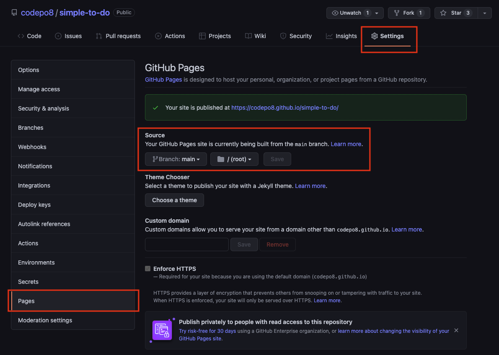

# Github page as a PWA template

This is a bare-bones example on how to turn an `index.html` document on GitHub and hosted as a GitHub Page into an installable Progressive Web App with offline caching.

As a reminder, you can host HTML, CSS and JavaScript files on GitHub as pages. For example, I have bare bones To Do app at https://github.com/codepo8/simple-to-do with an `index.html` document.

In the settings of this repository `simple-to-do`, I chose to publish the `main` branch as a GitHub page as shown in the following screenshot.



This means that this app is now available at https://codepo8.github.io/simple-to-do/. Every time I publish to the `main` branch, it triggers an action and the page is generated.

This here is a template repository that does not only publish the page, but also offers it as an installable app and shows the page when the user is offline.

## Changing the index.html

The first thing you need to do change is the `index.html` document. You need two things for this. Your GitHub username, for example in this case `codepo8` and the name of the repository you host as a GitHub Page, in this case `github-page-pwa`.

The current `index.html` has these settings already, and you need to change them accordingly.

In the following example, each `codepo8` needs to become yours and `github-page-pwa` the name of your repository. Make sure to not remove any `/`, as they are crucial for this to work.

``` html
<!DOCTYPE html>
<html lang="en">
<head>
  <meta charset="UTF-8">
  <meta name="viewport" content="width=device-width, initial-scale=1.0">
  <title>GitHub page as PWA template</title>
  <link rel="canonical" href="https://codepo8.github.io/github-page-pwa/" />
  <link rel="manifest" href="/github-page-pwa/manifest.webmanifest">
</head>
<body>
  <h1>GitHub page as PWA template</h1>
    …
  <script>
      if (navigator.serviceWorker) {
        navigator.serviceWorker.register (
          '/github-page-pwa/sw.js',
          {scope: '/github-page-pwa/'}
        )
      }
  </script>
</body>
</html>
```

## Changing the service worker to make your site available offline

The `sw.js` file is the ServiceWorker that defines which of the files in your application should become available offline. Again you need to change some settings to your needs.

``` javascript

// Change this to your repository name
var GHPATH = '/github-page-pwa';

// Choose a different app prefix name
var APP_PREFIX = 'gppwa_';

// The version of the cache. Every time you change any of the files
// you need to change this version (version_01, version_02…). 
// If you don't change the version, the service worker will give your
// users the old files!
var VERSION = 'version_00';

// The files to make available for offline use. make sure to add 
// others to this list
var URLS = [    
  `${GHPATH}/`,
  `${GHPATH}/index.html`,
  `${GHPATH}/css/styles.css`,
  `${GHPATH}/js/app.js`
]
```

Next, you may want to make this page installable as an app.

## Changing the manifest to make your app installable

The `manifest.webmanifest` file defines the name and look of the GitHub Page as an installable application. You need to change the names, description, URLs and link to the icon of the application to your needs. I added comments here as to what is what.

``` javascript
{
  // Name of the app and short name in case there isn't enough space
  "name": "Github Page PWA",
  "short_name": "GPPWA",
  // Description what your app is
  "description": "Github Page as a Progressive Web App",

  // Scope and start URL - these need to change to yours
  "scope": "/github-page-pwa/",
  "start_url": "/github-page-pwa/",

  // colours of the app as displayed in the installer
  "background_color": "#ffffff",
  "theme_color": "#ffffff",

  // Display of the app. 
  //This could be "standalone", "fullscreen", "minimal-ui" or "browser"
  "display": "standalone", 
  
  // The possible icons to display. Make sure to change the src URL,
  // the type and the size to your needs. If the size isn't correct, 
  // you may not be able to install the app. 
  "icons": [
      {
        "src": "/github-page-pwa/img/icon.png",
        "type": "image/png",
        "sizes": "700x700"
      }
  ]
}
```
